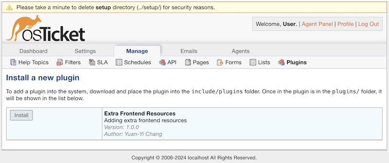
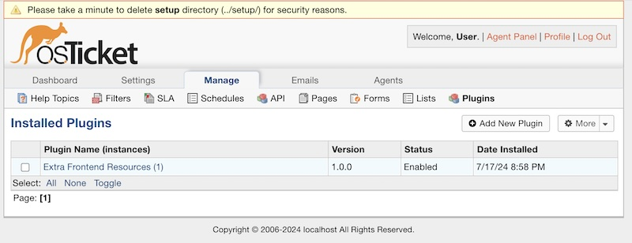
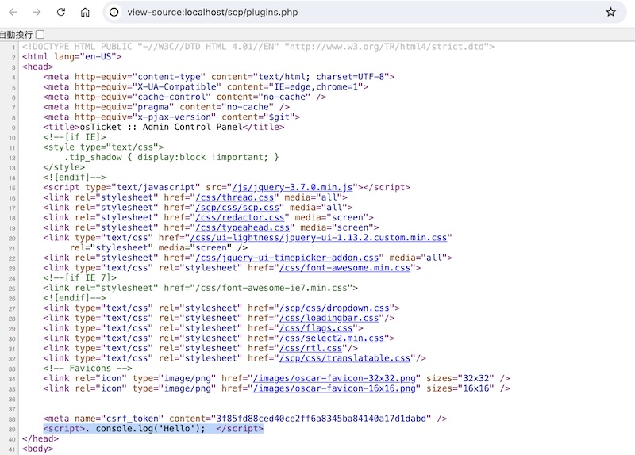

# osTicket-Plugins-Extra-Frontend-Resources
Adding Extra Frontend Resources

# Install

Step 1: Place the files in the following directories: `include/plugins/extra-frontend-resources/`

```bash
% tree include/plugins/extra-frontend-resources/
extra-frontend-resources
├── config.php
├── extraFrontendResourcesPlugin.php
└── plugin.php

1 directory, 3 files
```

Step 2: Check the `include/staff/header.inc.php:58` file and add the following code:

```php
Signal::send('staff.header.extra', null);
```

```bash
% cat -n osTicket/include/staff/header.inc.php | head -n 64 | tail -n 10
    55	    <link rel="icon" type="image/png" href="<?php echo ROOT_PATH ?>images/oscar-favicon-16x16.png" sizes="16x16" />
    56	
    57	    <?php
    58	    Signal::send('staff.header.extra', null);
    59	    if($ost && ($headers=$ost->getExtraHeaders())) {
    60	        echo "\n\t".implode("\n\t", $headers)."\n";
    61	    }
    62	    ?>
    63	</head>
    64	<body>
```

# Testing by Docker

```bash
% git clone https://github.com/changyy/osticket-study.git
% cd osticket-study
% docker build -t osticket-dev:develop -f develop/Dockerfile .
% git clone https://github.com/osTicket/osTicket.git /tmp/osTicket
% git clone https://github.com/changyy/osTicket-plugins-Extra-Frontend-Resources.git /tmp/osTicket-plugins-Extra-Frontend-Resources
% cp -r /tmp/osTicket-plugins-Extra-Frontend-Resources/extra-frontend-resources/ /tmp/osTicket/include/plugins/extra-frontend-resources 
% cp /tmp/osTicket/include/ost-sampleconfig.php /tmp/osTicket/include/ost-config.php 
% docker run -it -p 20022:22 -p 80:80 -p 3306:3306 -v /tmp/osTicket:/var/www/osticket-develop osticket-dev:develop 
 * Starting OpenBSD Secure Shell server sshd                                                               [ OK ] 
 * Starting MySQL database server mysqld                                                                          su: warning: cannot change directory to /nonexistent: No such file or directory
                                                                                                           [ OK ]
 * Starting nginx nginx                                                                                    [ OK ] 
==> /var/log/nginx/access.log <==

==> /var/log/nginx/error.log <==
```

Using `http://localhost/scp/plugins.php?a=add` to install the plugin.

more information: [osticket-study](https://github.com/changyy/osticket-study)

# Images

- 
- 
- 
